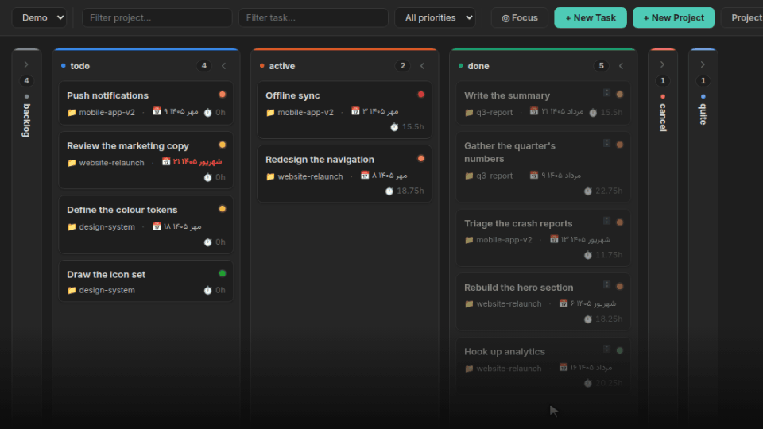
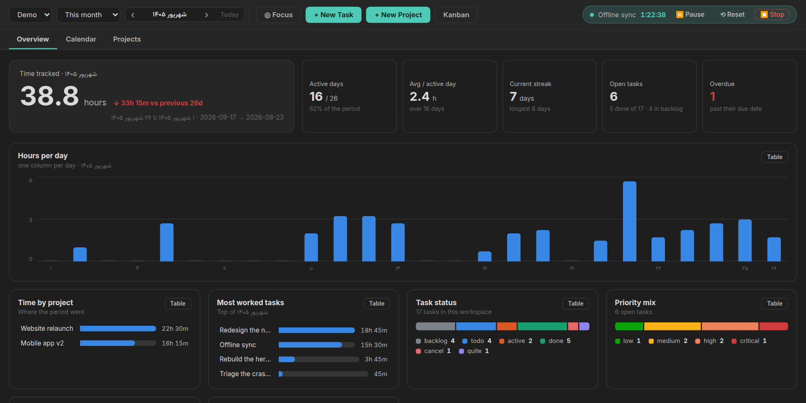
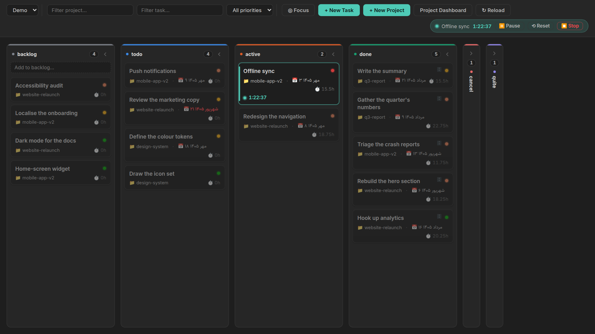
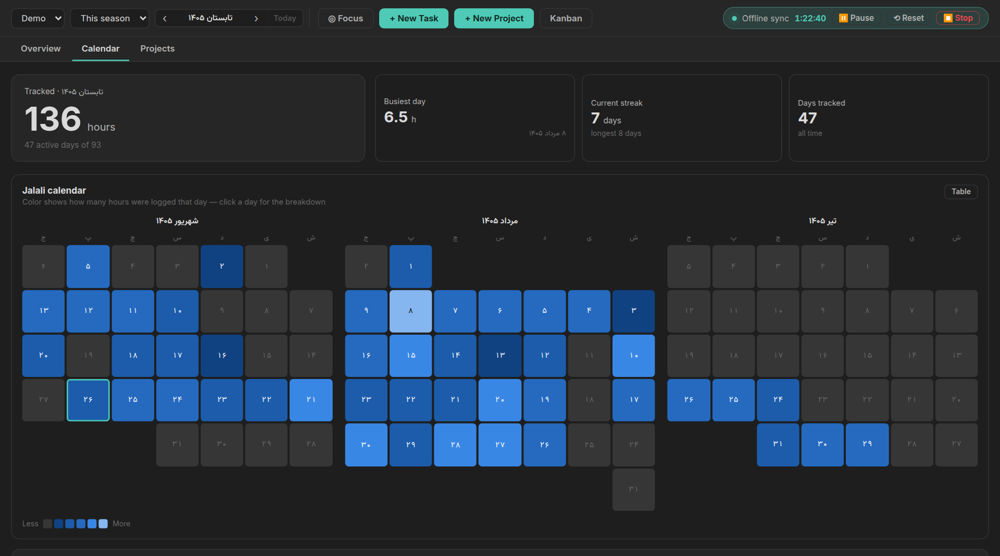
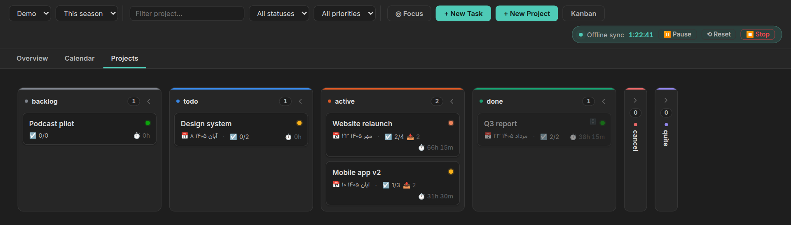

<div dir="rtl">

# مدیریت پروژه با زمان‌سنجی

*[English](README.md)*

پروژه‌ها و تسک‌ها را به‌شکل نوت‌های معمولی Markdown برنامه‌ریزی کن، زمانی که رویشان می‌گذاری را ثبت کن، و ببین آن زمان واقعاً کجا رفته. با تقویم **شمسی** یا میلادی کار می‌کند.

همه‌چیز داخل والت خودت به‌صورت نوت ساده با frontmatter می‌ماند. نه دیتابیسی هست نه قفلی: پلاگین را پاک کنی، پروژه‌ها و تسک‌هایت هنوز فایل‌های خواندنی‌اند.





## چه کار می‌کند

**تخته‌ی کانبان و زمان‌سنجی.** تسک‌ها به‌شکل کارت در ستون‌های وضعیت؛ با کشیدن، وضعیت عوض می‌شود. روی یک تسک تایمر بزن، وقتی کارت گیر افتاد پازش کن، و آخرش استاپ. **ساعتی که ثبت می‌شود زمان واقعی کارکرد است** — پاز، ناهار را به‌حساب کار نمی‌گذارد. تایمر از کرش و بستن برنامه جان سالم به در می‌برد: با هر تغییر وضعیت ذخیره می‌شود و موقع بالا آمدن برمی‌گردد، و می‌گوید چقدر شمرده تا خودت تصمیم بگیری نگهش داری یا دورش بیندازی. اگر وسط کار نوت تسک بایگانی یا تغییر نام داده شود، تایمر همچنان روی همان تسک می‌ماند.

**تایمر در نوار وضعیت.** وقتی تایمر روشن است، نوار پایین Obsidian نام تسک و زمان شمرده‌شده را نشان می‌دهد، تا موقع نوشتن در هر نوتی جلوی چشمت باشد. با کلیک رویش می‌توانی پاز یا ادامه بدهی، استاپ و ثبت کنی، صفرش کنی یا تسک را باز کنی.

**پومودورو.** از تنظیمات روشنش کن تا تایمر دوره‌ای کار کند: بعد از ۲۵ دقیقه زمان واقعی کار، خودش برای ۵ دقیقه استراحت پاز می‌شود (هر بار چهارم ۱۵ دقیقه) و بعد از استراحت دوباره راه می‌افتد. فقط زمانی که تایمر روشن است حساب می‌شود، پس پاز دستی دوره را نگه می‌دارد. دوره‌های تمام‌شده روی تسک شمرده می‌شوند و روی کارت با 🍅 دیده می‌شوند. همه‌ی زمان‌ها در تنظیمات قابل تغییرند.

**ویرایش زمان‌های ثبت‌شده.** تسک را باز کن و *Edit logged time* را بزن تا همه‌ی زمان‌های ثبت‌شده‌اش را با روز، شروع و پایان ببینی. روز، ساعت شروع یا مدت هر کدام را عوض کن یا حذفش کن؛ نوت تایم‌انتری، ردیف جدول Time Log و جمع ساعت تسک و پروژه همه با هم درست می‌شوند.



**بک‌لاگ.** کارهایی که شاید یک روز انجامشان بدهی ولی هنوز برشان نداشته‌ای. ستون خودش را دارد که پیش‌فرض جمع است، با یک فیلد یک‌خطی برای اضافه کردن: بنویس، Enter، بعدی. تسک‌های بک‌لاگ در تسک‌های باز، عقب‌افتاده‌ها و پیشرفت پروژه حساب نمی‌شوند، و تایمر زدن روی یکی‌شان آن را به *active* می‌برد.

**ستون‌های جمع‌شونده.** هر ستون در هر دو تخته یک فلش دارد که آن را به یک نوار باریک جمع می‌کند، و تخته یادش می‌ماند کدام‌ها را جمع کرده‌ای. روی نوار جمع‌شده هم می‌شود کارت انداخت.

**تمام‌صفحه.** یک دکمه روی هر دو تخته، تخته را روی کل پنجره می‌آورد و نوارهای کناری، ریبون، نوار تب‌ها و نوار وضعیت را پنهان می‌کند. یک سوییچ مشترک برای هر دو تخته است و یادش می‌ماند؛ دوباره بزنی یا Esc، همه‌چیز برمی‌گردد.

**تخته‌های راست‌به‌چپ.** یک تنظیم، کانبان و تخته‌ی پروژه‌ها را آینه می‌کند: ستون اول از راست شروع می‌شود و کارت‌ها راست‌به‌چپ خوانده می‌شوند. هر متن ترتیب زبان خودش را نگه می‌دارد.

**داشبورد.** سه تب:

- *مرور کلی* — ساعت‌های دوره، روزهای فعال، رشته‌ی جاری، تسک‌های باز و عقب‌افتاده، ساعت هر روز، زمان به تفکیک پروژه، پرکارترین تسک‌ها، تسک‌هایی که در دوره done شده‌اند (با زمان ثبت‌شده یا بی آن)، و توزیع وضعیت‌ها.
- *تقویم* — تقویم حرارتی دوره. روی هر روز کلیک کنی می‌بینی آن روز روی چه چیزی و چند ساعت کار کرده‌ای. حالت هفتگی، ماهانه، فصلی و سالانه.
- *پروژه‌ها* — تخته‌ی وضعیت پروژه‌ها با پیشرفت، ساعت و تعداد تسک.

هر دوره را می‌شود جلو و عقب برد، پس ماه‌ها و سال‌های گذشته در دسترس‌اند و همه‌چیز به «امروز» گره نخورده.





**فیلتر و فوکوس مد.** هر دو تخته را می‌شود بر اساس پروژه محدود کرد — بخشی از نام را تایپ کنی یا از فهرست انتخاب کنی — بر اساس اولویت، و روی تخته‌ی کانبان بر اساس عنوان تسک هم. یک دکمه‌ی فوکوس روی هر دو تخته هست که همه چیز جز ستون *active* را کنار می‌گذارد؛ روی هرکدام که بزنی، آن‌یکی هم همراهش می‌آید، چون یک سوییچ مشترک است نه دوتا جدا.

**گروه‌بندی بر اساس پروژه.** دکمه‌ی *By project* در کانبان کارت‌ها را بر اساس پروژه دسته می‌کند: یا یک ردیف برای هر پروژه که از همه‌ی ستون‌ها رد می‌شود، یا تسک‌های هر پروژه کنار هم داخل هر ستون — هرکدام که در تنظیمات انتخاب کنی. هر گروه جمع می‌شود و جمع‌شده می‌ماند. با سنجاق، یک پروژه همیشه بالا می‌ماند. بعد از آن تسک‌های بی‌پروژه می‌آیند تا زود پروژه بگیرند، و بقیه بر اساس آخرین کار، اولویت، تعداد تسک‌های تمام‌نشده یا نام مرتب می‌شوند. لبه‌ی ستون نام پروژه‌ها را بکش تا نام‌های بلند در یک خط جا شوند.

**تاریخ سررسید.** یک date picker که با تقویم هماهنگ است — بسته به تنظیم تقویم، شمسی یا میلادی رسم می‌شود — برای تسک‌ها و پروژه‌ها، تا تاریخ سررسید همه‌جای داشبورد یک‌شکل خوانده شود.

**بایگانی.** تسک یا پروژه‌ای که به یک وضعیت بسته برسد (done، cancel و quite، مگر اینکه فهرستش را در تنظیمات عوض کنی)، همراه با تایم‌انتری‌هایش به پوشه‌ی بایگانی منتقل می‌شود. بستن یک پروژه، تسک‌هایش را هم با خودش می‌برد. برگرداندن هم همین مسیر را برعکس می‌رود، با یک استثنا: تسکی که مستقلاً done است سر جایش می‌ماند، چون بایگانی‌شدنش ربطی به پروژه نداشته. آیتم بایگانی‌شده همچنان در تخته و همه‌ی گزارش‌ها دیده می‌شود — فقط فایلش جابه‌جا شده.

**فضاهای کاری.** مجموعه‌های جدا از پوشه‌ها — مثلاً کاری و شخصی — هرکدام با پروژه‌ها، تسک‌ها، تایم‌انتری‌ها و بایگانی خودش.

**تقویم.** شمسی یا میلادی، با هفته‌ای که از هر روزی که تو می‌خواهی شروع شود. گروه‌بندی ماه، مرز هفته، فصل و سه‌ماهه، ارقام و برچسب‌ها همه از این انتخاب پیروی می‌کنند.

**جمع‌هایی که درست می‌مانند.** فیلدهای `hours` و `task_count` نوت هر پروژه همراه با تسک‌هایش به‌روز می‌شوند. اگر جمع‌ها از زمان ثبت‌شده فاصله گرفتند، مثلاً بعد از ویرایش دستی نوت‌ها، دستور **Rebuild totals from logged time** همه‌ی تسک‌ها و پروژه‌های فضای کاری را دوباره می‌شمارد.

## شروع

۱. از پالت دستورات **Open kanban board** یا **Open project dashboard** را بزن، یا از آیکون‌های نوار کناری.
۲. یک پروژه بساز، بعد زیرش تسک.
۳. تایمر را از منوی راست‌کلیک کارت، از پنجره‌ی تسک، یا با دستور **Start timer on the open note** شروع کن.

پوشه‌ها در اولین اجرا خودکار ساخته می‌شوند و همه‌شان در تنظیمات قابل تغییرند.

## نوت‌ها فقط نوت‌اند

یک تسک، نوتی است با frontmatter و جدول Time Log:

<div dir="ltr">

```markdown
---
type: task
title: "نوشتن یادداشت انتشار"
project: "[[website-relaunch]]"
status: "active"
priority: "medium"
due: "2026-08-20"
total_hours: 3.5
days_count: 2
workspace: "[[Work]]"
---

# نوشتن یادداشت انتشار

## Time Log

| Date | Hours | Start | End |
|------|-------|-------|-----|
| 2026-08-18 | 2 | 2026-08-18T09:00:00.000Z | 2026-08-18T11:00:00.000Z |
```

</div>

هرچه بیشتر از این تمپلیت بنویسی مال خودت است، و تخته کارت‌هایی که یادداشت دارند را علامت می‌زند تا بدون باز کردن تک‌تکشان پیدایشان کنی.

هر زمان ثبت‌شده یک نوت کوچک هم در پوشه‌ی TimeEntries فضای کاری دارد که تسک، ساعت، شروع و پایانش را نگه می‌دارد. زمان‌ها را از پنجره‌ی تسک ویرایش یا حذف کن نه دستی، تا هر سه جا با هم هماهنگ بمانند.

## تنظیمات

- **تقویم**، **شروع هفته** و **جهت تخته‌ها** (چپ‌به‌راست یا راست‌به‌چپ)
- **گروه‌بندی تسک‌ها بر اساس پروژه** — یک ردیف برای هر پروژه، یا دسته‌ها داخل هر ستون
- **ترتیب پروژه‌ها** — آخرین کار، اولویت پروژه، بیشترین تسک تمام‌نشده یا نام؛ سنجاق‌شده‌ها همیشه اول
- **حذف تسک یا پروژه** — به سطل زباله یا حذف کامل
- **فضاهای کاری** — نام و پوشه‌ی پروژه‌ها، تسک‌ها، تایم‌انتری‌ها و بایگانی. تغییر نام فضای کاری همه‌ی نوت‌هایش را هم به‌روز می‌کند.
- **پوشه‌ی بایگانی** برای هر فضای کاری، و دکمه‌ی *Tidy archive* برای آیتم‌هایی که قبل از فعال‌شدن بایگانی بسته شده‌اند. خالی بگذاری، بایگانی خاموش می‌شود.
- **وضعیت‌ها** و **اولویت‌ها** — ستون‌های تخته از فهرست وضعیت‌ها می‌آیند
- **وضعیت‌های بسته** — کدام وضعیت‌ها آیتم را بایگانی می‌کنند و از کارهای باز بیرونش می‌گذارند
- **تغییر نام وضعیت** — هم در تنظیمات و هم در همه‌ی نوت‌های تسک و پروژه
- **پومودورو** — روشن یا خاموش، طول دوره و استراحت، و ادامه‌ی خودکار بعد از استراحت

## دستورات

| دستور | کار |
| --- | --- |
| Open kanban board | باز کردن تخته |
| Open project dashboard | باز کردن داشبورد |
| New task / New project | ساخت تسک یا پروژه |
| New task in backlog | همان «+» ستون بک‌لاگ، از هرجا |
| Start timer on the open note | روی نوت باز، اگر تسک باشد |
| Pause or resume the timer | پاز و ادامه |
| Stop the timer | ثبت زمان کارکرد |
| Reset the timer | برگشت به صفر، همچنان در حال کار، بدون ثبت |
| Discard the timer | دور انداختن تایمر |
| Toggle focus mode | فقط آیتم‌های active — مشترک بین هر دو تخته |
| Toggle full screen for the boards | تمام‌صفحه — مشترک بین هر دو تخته |
| Tidy archive | بردن بسته‌ها به بایگانی و برگرداندن بازشده‌ها |
| Rebuild totals from logged time | شمارش دوباره‌ی جمع همه‌ی تسک‌ها و پروژه‌ها |
| Pomodoro: end the break now | وقتی پومودورو روشن است |

## برای نویسندگان پلاگین

این پلاگین یک API کوچک و نسخه‌دار بیرون می‌دهد تا پلاگین همراه بتواند تسک واقعی بسازد، به‌جای بازتولید فرمت frontmatter:

<div dir="ltr">

```js
const pm = app.plugins.plugins["project-manager-with-time-tracking"]?.api;
if (pm?.version >= 1) {
  const project = await pm.ensureProject(workspaceId, { title: "Website relaunch" });
  await pm.createTask(workspaceId, {
    title: "Write the release notes",
    projectSlug: project.slug,
    extra: { source_id: "abc-123" },
  });
}
```

</div>

متدهای `listWorkspaces`، `listProjects`، `ensureProject`، `createTask` و `findTaskBy` در دسترس‌اند. با `findTaskBy` می‌فهمی چیزی را قبلاً وارد کرده‌ای یا نه.

## حمایت

این پروژه رایگان عرضه شده تا همه بدون محدودیت بتوانند استفاده کنند. اگر برایت مفید بود، می‌توانی از ادامه‌ی توسعه‌اش حمایت کنی.

<a href="https://www.coffeete.ir/milads55">
  
</a>
<br><br>
<a href="https://buymeabitcoffee.vercel.app/btc/bc1qwxju09p2wywqqq8udj2am8csvn6r4p4z6720q3">
  
</a>

## پروانه

MIT — فایل [LICENSE](LICENSE).

</div>
