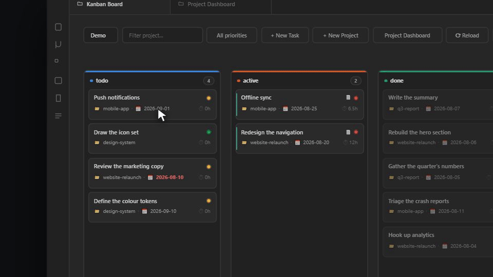

# Project Manager with Time Tracking

*[فارسی](README.fa.md)*

Plan projects and tasks as ordinary Markdown notes, track time against them, and see where that time actually went. Works in the Gregorian or the Jalali (Shamsi/Persian) calendar.

Everything lives in your vault as plain notes with frontmatter. There is no database and no lock-in: delete the plugin and your projects and tasks are still readable files.




## What it does

**Kanban board and time tracking.** Tasks as cards in status columns, drag to change status. Start a timer on a task, pause it when you get pulled away, stop it when you are done. Logged hours are the time actually worked — a pause does not bill lunch as work. The timer survives a crash or a restart: it is stored on every state change and restored on load, telling you how long it thinks it has been running so you can keep or discard it.


**Dashboard.** Three tabs:

- *Overview* — hours for the period, active days, current streak, open and overdue tasks, hours per day, time by project, most-worked tasks, task status breakdown.
- *Calendar* — a heat calendar of the period. Click a day to see what you worked on and for how long. Weekly, monthly, seasonal and yearly shapes.
- *Projects* — a status board of projects with progress, hours and task counts.

Every period can be stepped backwards and forwards, so past months and years are reachable rather than everything being pinned to today.


**Filters and focus mode.** Narrow either board down by project — type part of a name or pick one from the list — by priority, or on the Kanban board by task title too. A Focus button on both boards drops everything but the *active* column; toggle it on either board and the other follows, since it is one shared switch rather than two.

**Due dates.** A calendar-aware date picker for tasks and projects — it draws in Gregorian or Jalali, whichever the calendar setting is, so a due date reads the same everywhere on the dashboard.

**Archive.** When a task or project reaches done, cancel or quite it moves into an archive folder together with its time entries. Closing a project takes its tasks with it. Reopening walks it back, except that a task which is done in its own right stays put. Archived items still appear in the board and every report — only the files move.

**Workspaces.** Separate sets of folders — work and personal, say — each with its own projects, tasks, time entries and archive.

**Calendar.** Gregorian or Jalali (Shamsi/Persian), with the week starting on whichever day you use. Month grouping, week boundaries, seasons and quarters, digits and labels all follow the choice.

## Getting started

1. Open the command palette and run **Open Kanban Board** or **Open Project Dashboard**, or use the ribbon icons.
2. Create a project, then tasks under it.
3. Start a timer from a task's card menu, from the task modal, or with **Start Timer** on the open note.

Folders are created for you on first run. Everything about them is configurable in settings.

## Notes are just notes

A task is a note with frontmatter and a Time Log table:

```markdown
---
type: task
title: "Write the release notes"
project: "[[website-relaunch]]"
status: "active"
priority: "medium"
due: "2026-08-20"
total_hours: 3.5
days_count: 2
workspace: "[[Work]]"
---

# Write the release notes

## Time Log

| Date | Hours | Start | End |
|------|-------|-------|-----|
| 2026-08-18 | 2 | 2026-08-18T09:00:00.000Z | 2026-08-18T11:00:00.000Z |
```

Anything you write beyond that template is yours, and the board marks cards that carry notes so you can find them without opening each one.

## Settings

- **Calendar** and **week start**
- **Workspaces** — name and folder for projects, tasks, time entries and the archive
- **Archive folder** per workspace, and a *Tidy archive* button for items closed before archiving existed. Leave the folder empty to turn archiving off.
- **Statuses** and **priorities** — the board's columns follow the status list

## Commands

| Command | What it does |
| --- | --- |
| Open Kanban Board | |
| Open Project Dashboard | |
| New Task / New Project | |
| Start Timer | on the active note, if it is a task |
| Pause / Resume Timer | |
| Stop Timer | logs the tracked time |
| Reset Timer | back to zero, still running, nothing logged |
| Discard Timer | throws it away |
| Toggle Focus Mode | active items only — shared between both boards |
| Tidy archive | moves closed items, restores reopened ones |

## For other plugin authors

The plugin exposes a small versioned API so a companion plugin can create real tasks rather than reproducing the frontmatter format:

```js
const pm = app.plugins.plugins["project-manager-with-time-tracking"]?.api;
if (pm?.version >= 1) {
  const project = await pm.ensureProject(workspaceId, { title: "Website relaunch" });
  await pm.createTask(workspaceId, {
    title: "Write the release notes",
    projectSlug: project.slug,
    extra: { source_id: "abc-123" },   // your own id, for skipping duplicates later
  });
}
```

`listWorkspaces`, `listProjects`, `ensureProject`, `createTask` and `findTaskBy` are available. `findTaskBy(workspaceId, key, value)` is how you tell whether you already imported something.

## Support

This project is offered for free so everyone can use it without restrictions.
If you found this tool useful, you can support its continuous development and improvement through donations.

<a href="https://www.coffeete.ir/milads55">
  
</a>
<br><br>
<a href="https://buymeabitcoffee.vercel.app/btc/bc1qwxju09p2wywqqq8udj2am8csvn6r4p4z6720q3">
  
</a>

## Licence

MIT — see [LICENSE](LICENSE).
