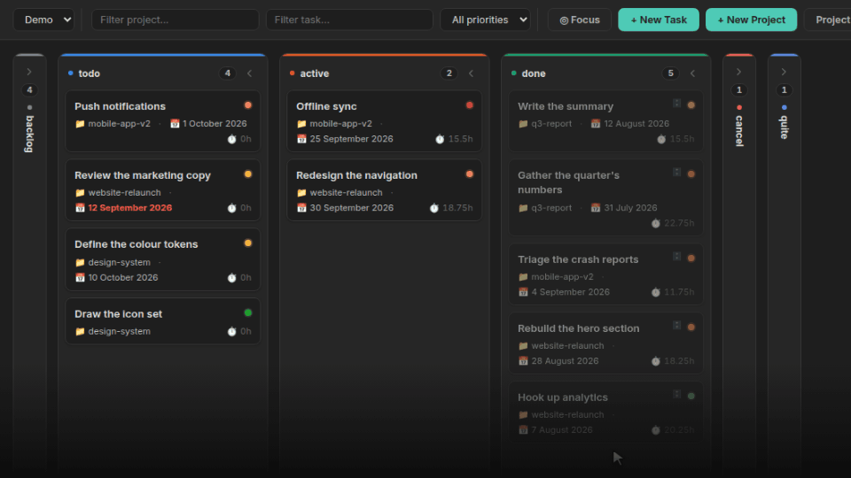
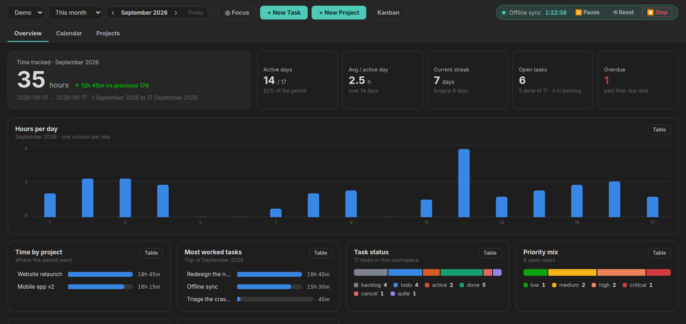
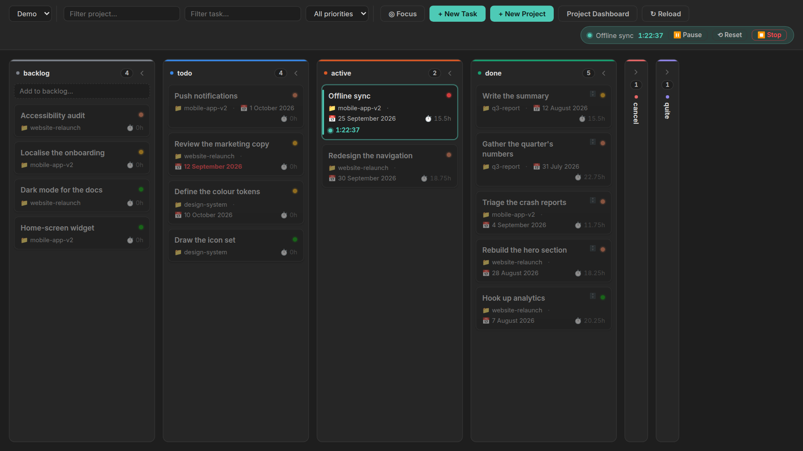
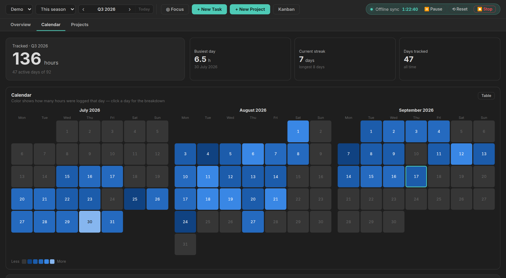
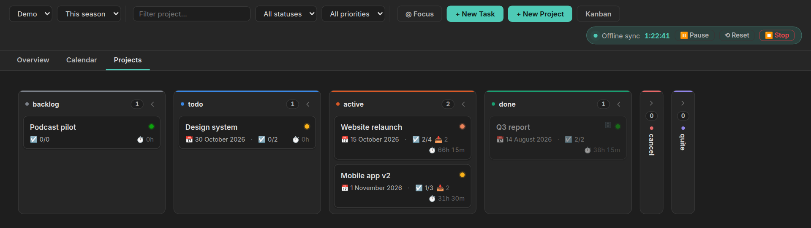
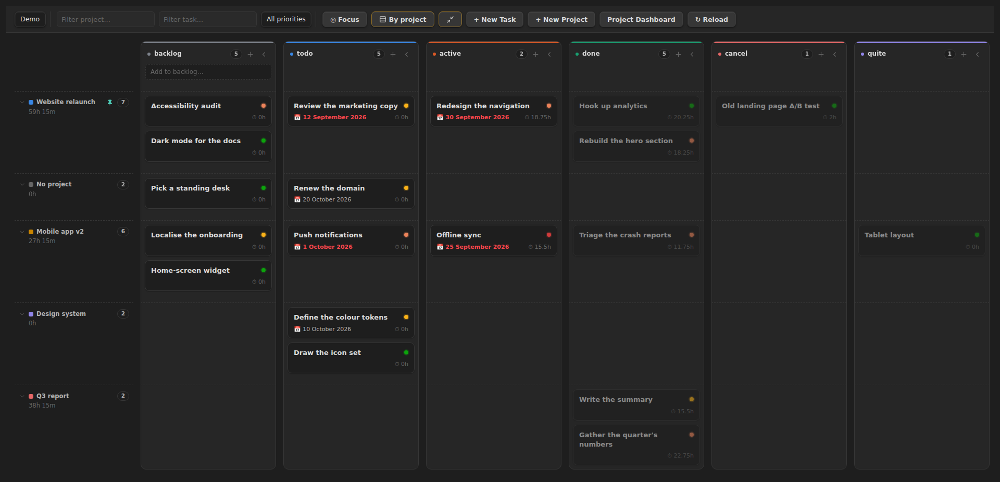

# Project Manager with Time Tracking

*[فارسی](README.fa.md)*

Plan projects and tasks as ordinary Markdown notes, track time against them, and see where that time actually went. Works in the Gregorian or the Jalali (Shamsi/Persian) calendar.

Everything lives in your vault as plain notes with frontmatter. There is no database and no lock-in: delete the plugin and your projects and tasks are still readable files.





## What it does

**Kanban board and time tracking.** Tasks as cards in status columns, drag to change status. Start a timer on a task, pause it when you get pulled away, stop it when you are done. Logged hours are the time actually worked — a pause does not bill lunch as work. The timer survives a crash or a restart: it is stored on every state change and restored on load, telling you how long it thinks it has been running so you can keep or discard it. A timer keeps to its task even when the task's note is archived or renamed while it runs.

**Timer in the status bar.** While a timer runs, Obsidian's status bar shows its task and the time so far, so it stays in sight while you write in any note. Click it to pause or resume, stop and log, reset, or open the task.

**Pomodoro.** Switch it on in settings and the timer works in rounds: after 25 minutes of running time it pauses itself for a 5-minute break (every fourth break a 15-minute one) and starts again when the break is over. Only running time counts, so pausing by hand holds the round. Finished rounds are counted on the task and shown as 🍅 on its card. All the lengths are settings.

**Edit logged time.** Open a task and choose *Edit logged time* to see every session logged on it, with its day, start and end. Change a session's day, start time or length, or delete it, and the time entry note, the task's Time Log row and the totals of the task and its project all change together.



**Backlog.** Work you may do one day but have not taken on yet. It gets its own column, folded by default, with a one-line field for adding to it: type, Enter, next. Backlog tasks stay out of open tasks, overdue and project progress, and starting a timer on one moves it to *active*.

**Foldable columns.** Every column on either board has an arrow that folds it into a narrow bar, and the board remembers which ones you folded. A folded bar still takes a dropped card.

**Full screen.** A button on both boards lifts the board over the whole window, hiding the sidebars, ribbon, tab bar and status bar. It is one switch for both boards and is remembered; press it again or Esc to get everything back.

**Right-to-left boards.** A setting mirrors the Kanban and the projects board, so the first column starts on the right and cards read right to left. Each piece of text keeps the order of its own language.

**Dashboard.** Three tabs:

- *Overview* — hours for the period, active days, current streak, open and overdue tasks, hours per day, time by project, most-worked tasks, tasks done in the period (time logged or not), task status breakdown.
- *Calendar* — a heat calendar of the period. Click a day to see what you worked on and for how long. Weekly, monthly, seasonal and yearly shapes.
- *Projects* — a status board of projects with progress, hours and task counts.

Every period can be stepped backwards and forwards, so past months and years are reachable rather than everything being pinned to today.





**Filters and focus mode.** Narrow either board down by project — type part of a name or pick one from the list — by priority, or on the Kanban board by task title too. A Focus button on both boards drops everything but the *active* column; toggle it on either board and the other follows, since it is one shared switch rather than two.

**Group by project.** The Kanban's *By project* button groups the cards by project: a row per project across the columns, or each project's tasks kept together inside every column, as chosen in settings. Groups fold, and stay folded. Pin a project to keep it at the top. Tasks with no project come next, ready to be given one, and the other projects are ordered by recent work, priority, unfinished tasks or name. Drag the edge of the project names to fit long names on one line.



**Due dates.** A calendar-aware date picker for tasks and projects — it draws in Gregorian or Jalali, whichever the calendar setting is, so a due date reads the same everywhere on the dashboard.

**Archive.** When a task or project reaches a closed status (done, cancel and quite unless you change the list in settings) it moves into an archive folder together with its time entries. Closing a project takes its tasks with it. Reopening walks it back, except that a task which is done in its own right stays put. Archived items still appear in the board and every report — only the files move.

**Workspaces.** Separate sets of folders — work and personal, say — each with its own projects, tasks, time entries and archive.

**Calendar.** Gregorian or Jalali (Shamsi/Persian), with the week starting on whichever day you use. Month grouping, week boundaries, seasons and quarters, digits and labels all follow the choice.

**Totals that stay right.** A project note's `hours` and `task_count` follow its tasks as they change. If the totals ever drift from the logged time, for example after editing notes by hand, **Rebuild totals from logged time** recounts every task and project in the workspace.

## Getting started

1. Open the command palette and run **Open kanban board** or **Open project dashboard**, or use the ribbon icons.
2. Create a project, then tasks under it.
3. Start a timer from a task's card menu, from the task dialog, or with **Start timer on the open note**.

Folders are created for you on first run. Everything about them is configurable in settings.

## Notes are just notes

A task is a note with frontmatter and a Time Log table:

```markdown
---
type: task
title: "Write the release notes"
project: "[[website-relaunch]]"
status: "active"
priority: "medium"
due: "2026-08-20"
total_hours: 3.5
days_count: 2
workspace: "[[Work]]"
---

# Write the release notes

## Time Log

| Date | Hours | Start | End |
|------|-------|-------|-----|
| 2026-08-18 | 2 | 2026-08-18T09:00:00.000Z | 2026-08-18T11:00:00.000Z |
```

Anything you write beyond that template is yours, and the board marks cards that carry notes so you can find them without opening each one.

Each logged session also gets a small note of its own in the workspace's TimeEntries folder, holding its task, hours, start and end. Edit or delete sessions from the task dialog rather than by hand, so all three places stay in step.

## Settings

- **Calendar**, **week start** and **board direction** (left to right or right to left)
- **Group tasks by project** — a row per project, or groups inside each column
- **Hide projects on the task board** — projects in these statuses, and their tasks, stay off the Kanban (done, cancel and quite by default)
- **Order of projects** — most recently worked on, project priority, most unfinished tasks or name; pinned projects come first
- **Deleting a task or project** — to the trash, or permanently
- **Workspaces** — name and folder for projects, tasks, time entries and the archive. Renaming a workspace updates all of its notes to match.
- **Archive folder** per workspace, and a *Tidy archive* button for items closed before archiving existed. Leave the folder empty to turn archiving off.
- **Statuses** and **priorities** — the board's columns follow the status list
- **Closed statuses** — which statuses archive an item and leave it out of open work
- **Rename a status** — renames it in settings and in every task and project note
- **Pomodoro** — on or off, round and break lengths, and whether to resume after a break
- **What's new** — whether it opens by itself after an update

## Commands

| Command | What it does |
| --- | --- |
| Open kanban board | |
| Open project dashboard | |
| New task / New project | |
| New task in backlog | the backlog column's "+", from anywhere |
| Start timer on the open note | if the open note is a task |
| Pause or resume the timer | |
| Stop the timer | logs the tracked time |
| Reset the timer | back to zero, still running, nothing logged |
| Discard the timer | throws it away |
| Toggle focus mode | active items only — shared between both boards |
| Toggle full screen for the boards | shared between both boards |
| Tidy archive | moves closed items, restores reopened ones |
| Rebuild totals from logged time | recounts every task's and project's totals |
| Pomodoro: end the break now | when Pomodoro is on |
| What's new | what changed in this version |

## For other plugin authors

The plugin exposes a small versioned API so a companion plugin can create real tasks rather than reproducing the frontmatter format:

```js
const pm = app.plugins.plugins["project-manager-with-time-tracking"]?.api;
if (pm?.version >= 1) {
  const project = await pm.ensureProject(workspaceId, { title: "Website relaunch" });
  await pm.createTask(workspaceId, {
    title: "Write the release notes",
    projectSlug: project.slug,
    extra: { source_id: "abc-123" },   // your own id, for skipping duplicates later
  });
}
```

`listWorkspaces`, `listProjects`, `ensureProject`, `createTask` and `findTaskBy` are available. `findTaskBy(workspaceId, key, value)` is how you tell whether you already imported something.

## Support

This project is offered for free so everyone can use it without restrictions.
If you found this tool useful, you can support its continuous development and improvement through donations.

<a href="https://www.coffeete.ir/milads55">
  
</a>
<br><br>
<a href="https://buymeabitcoffee.vercel.app/btc/bc1qwxju09p2wywqqq8udj2am8csvn6r4p4z6720q3">
  
</a>

## Licence

MIT — see [LICENSE](LICENSE).
